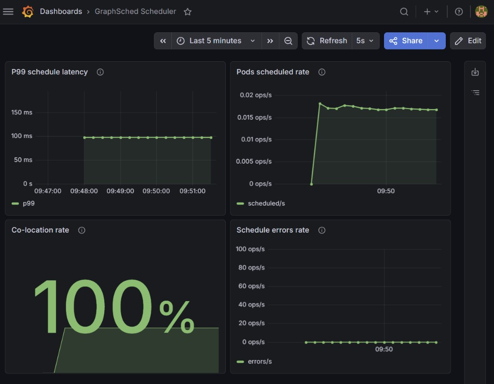

# GraphSched

A custom Kubernetes scheduler that places pods based on which pods communicate with each other, not just how much CPU and memory a node has free.

*Python · Kubernetes Python client · networkx · Prometheus · Grafana · kind · pytest · GitHub Actions*

I built GraphSched to learn how the Kubernetes scheduler works and to test whether building a service dependency graph could improve pod co-location compared to the default scheduler. In my test workloads it co-locates every dependent pod pair, where the default scheduler manages about 17–25%. That comes with some added scheduling latency, which I break down below.

## What it does

The default scheduler is resource-aware but topology-blind. It doesn't know that your frontend depends on your backend, which depends on your database, unless you hand-write pod affinity rules. GraphSched automatically works it out:

1. **Watches** pods, Services, and PVCs in the cluster (a set of background watchers).
2. **Infers a dependency graph** — it links pods by reading Service selectors and environment variables (e.g. a pod with `BACKEND_URL=http://bench-backend-svc` depends on whatever backs that Service).
3. **Scores each node** for a pending pod and binds it to the best one:

```
score = 0.7 × co-location fraction + 0.3 × resource balance
```

- **Co-location fraction** is what share of this pod's graph neighbors already live on the node, weighted by edge weight.
- **Resource balance** is the geometric mean of free CPU and free memory, so a node has to have room on both.

Pods that communicate end up on the same node, which cuts cross-node hops, and I don't have to write any affinity annotations.

## Results

Benchmarked against the default scheduler on a 4-worker [kind](https://kind.sigs.k8s.io/) cluster, 3 runs each, two workloads (`chain`: db→backend→frontend, `hub`: 1 hub + 4 spokes). Full table in [`results/final_summary.md`](results/final_summary.md).

| Scheduler | Workload | Avg P99 (ms) | Avg co-location |
|-----------|----------|--------------|-----------------|
| default-scheduler | chain | 507.4 | 0.167 |
| **graphsched** | chain | 859.6 | **1.000** |
| default-scheduler | hub | 377.5 | 0.250 |
| **graphsched** | hub | 437.7 | **1.000** |

GraphSched co-locates **100%** of dependent pod pairs on both workloads, which is the consistent result across every run.

The P99 numbers above are end-to-end (pod creation to bound). Most of that time is queue wait and apiserver round-trips, not the scheduler itself: GraphSched's own scoring decision is about **50–100ms per pod** in the Grafana histogram (`graphsched_schedule_latency_seconds`). That said, the per-pod Python scoring and dependency-ordered batching do add overhead, so GraphSched ran slower end-to-end than the default scheduler in this matrix (clearly on chain, where the P99 ranges don't overlap), and latency is noisy run-to-run on kind. The goal here is dependency-aware co-location, not beating the default scheduler on raw scheduling speed.

Caveat: these workloads are small enough that all pods fit on a single node, so GraphSched stacks dependents together to reach 1.0. A production version would have to weigh co-location against spreading and fault tolerance. The 0.3 resource-balance term in the score is a first step toward that trade-off.



## Quick start

Requires Docker, [kind](https://kind.sigs.k8s.io/), `kubectl`, and Python 3.11+. I run this in WSL.

```bash
# 1. Cluster (1 control-plane + 4 workers)
kind create cluster --name graphsched --config kind-config.yaml

# 2. Python deps
python3 -m venv .venv && source .venv/bin/activate
pip install -r requirements.txt

# 3. Tests
pytest -q                      # 36 passing

# 4. Benchmark GraphSched vs the default scheduler
python3 benchmark/run_benchmark.py --scheduler default    --workload chain
python3 benchmark/run_benchmark.py --scheduler graphsched --workload chain

# 5. Full matrix (3 runs x 2 schedulers x 2 workloads) + summary
./scripts/run_matrix.sh
python3 scripts/summarize_matrix.py
```

The scheduler also exposes Prometheus metrics on `:9100` (`graphsched_schedule_latency_seconds`, `graphsched_pods_scheduled_total`, `graphsched_schedule_errors_total`, `graphsched_colocation_rate`). See [`docs/BENCHMARKING.md`](docs/BENCHMARKING.md) for the monitoring setup.

## How it's built

| Piece | What it does |
|-------|--------------|
| `watcher/` | Background watchers + the live dependency graph (`networkx`) |
| `scheduler/graphsched.py` | The scheduler loop: watch pending pods, batch them in dependency order, score, bind |
| `scheduler/topology_scorer.py` | The `0.7 × topology + 0.3 × resource` scoring |
| `scheduler/metrics.py` | Prometheus metrics |
| `benchmark/` | Workloads, the benchmark runner, and the co-location metric |
| `monitoring/` | Prometheus scrape config + Grafana dashboard JSON |

More detail in [`docs/ARCHITECTURE.md`](docs/ARCHITECTURE.md).

## Future steps

- The benchmark only reports end-to-end latency. I want to break out scheduler decision time from queue and apiserver propagation directly in the benchmark output, not just in the Grafana histogram.
- Edge inference is heuristic right now (Services plus env vars). Real traffic data from eBPF or service mesh metrics would make the graph more accurate.
- Co-location is a proxy for reducing cross-node latency. Measuring actual RPC latency end to end would close the loop.
